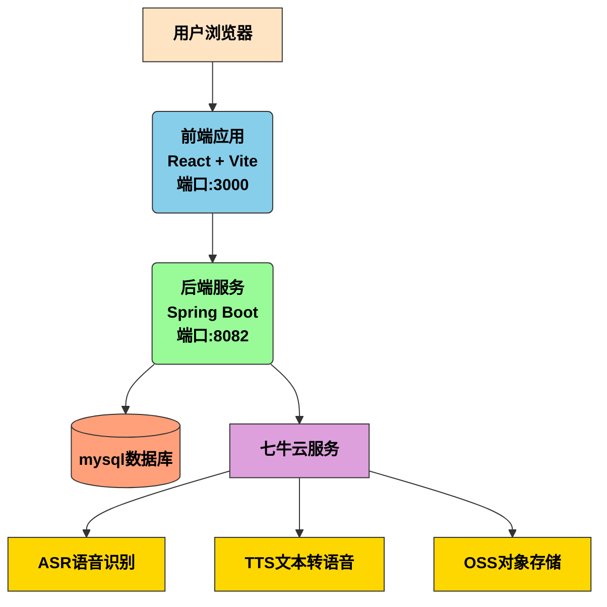
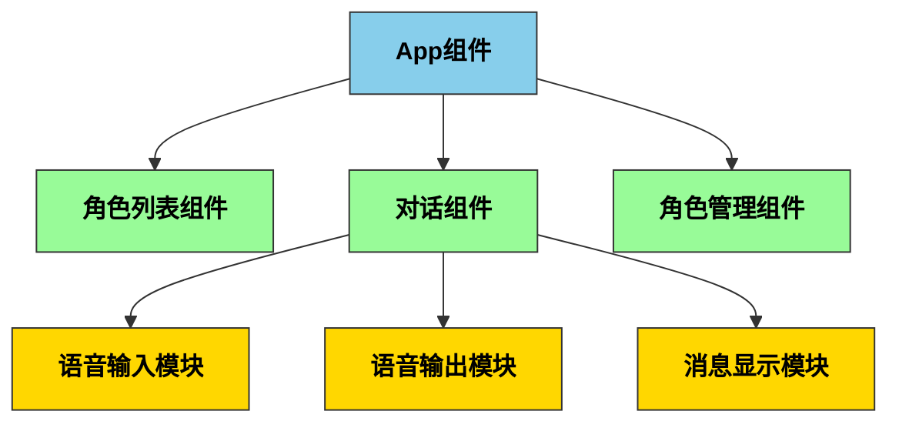
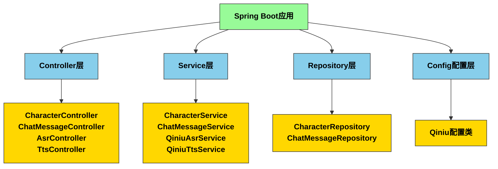

# AI角色扮演平台

AI角色扮演平台是一个前后端分离的Web应用程序，允许用户与不同的AI角色进行文本和语音交互。该平台提供了角色管理、对话历史记录、语音识别(ASR)和文本转语音(TTS)等功能。

## 视频演示

[AI角色扮演平台视频演示](https://www.bilibili.com/video/BV1sKnozMEBR/?vd_source=c9e7ae51b585630064786aaf64717678)

## 功能特性

- 多角色对话：与不同的AI角色进行文本对话
- 语音交互：支持语音输入和语音输出
- 角色管理：创建、编辑和删除AI角色
- 对话历史：保存和查看对话记录
- 全屏模式：提供沉浸式对话体验
- 响应式设计：支持桌面和移动设备

## 技术架构

### 整体架构图

> **注意**: 如果您看不到下面的架构图，说明您的Markdown查看器不支持Mermaid渲染。请安装支持Mermaid的编辑器（如VS Code配合Mermaid插件）或查看项目根目录下的架构图图片文件。



### 前端技术栈
- React 17+
- Vite构建工具
- CSS3 + Flexbox布局

### 前端架构图



### 后端技术栈
- Spring Boot (Java)
- Maven构建工具
- RESTful API设计

### 后端架构图




## 环境要求

### 前端
- Node.js >= 14.0.0
- npm >= 6.0.0

### 后端
- Java JDK 8+
- Maven 3.6+

## 安装与运行

### 1. 克隆项目

```bash
git clone <repository-url>
cd AI-Role-playing
```

### 2. 后端运行

```bash
cd backend
mvn spring-boot:run
```

后端服务将运行在 `http://localhost:8082`

### 3. 前端运行

```bash
cd frontend
npm install
npm run dev
```

前端开发服务器将运行在 `http://localhost:3000` 

### 4. 访问应用

打开浏览器访问 `http://localhost:3000`

## 项目结构

```
AI-Role-playing/
├── backend/              # 后端代码
│   ├── src/              # 源代码
│   │   ├── main/
│   │   │   ├── java/com/ai/roleplay/
│   │   │   │   ├── controller/    # 控制器
│   │   │   │   ├── model/        # 数据模型
│   │   │   │   ├── repository/   # 数据访问层
│   │   │   │   ├── service/      # 业务逻辑层
│   │   │   │   └── config/       # 配置文件
│   │   │   └── resources/
│   │   └── test/         # 测试代码
│   └── pom.xml           # Maven配置文件
└── frontend/             # 前端代码
    ├── src/              # 源代码
    ├── index.html        # 入口HTML文件
    ├── package.json      # npm配置文件
    └── vite.config.js    # Vite配置文件
```

## API接口

### 角色管理
- `GET /api/characters` - 获取所有角色
- `POST /api/characters` - 创建新角色
- `DELETE /api/characters/{id}` - 删除角色
- `GET /api/characters/search` - 搜索角色

### 对话接口
- `GET /api/chat/history/{characterId}` - 获取对话历史
- `POST /api/chat/send` - 发送消息

### 语音接口
- `POST /api/asr/transcribe` - 语音转文本
- `POST /api/tts/speak` - 文本转语音

## 配置说明

### 后端配置
在 `backend/src/main/resources/application.properties` 中配置：

```properties
# 服务器端口
server.port=8082

# 七牛云配置
qiniu.access-key=your-access-key
qiniu.secret-key=your-secret-key
qiniu.asr.bucket=your-asr-bucket
qiniu.tts.bucket=your-tts-bucket
```

### 前端配置
前端通过Vite代理解决跨域问题，代理配置在 `vite.config.js` 中。

## 开发指南

### 添加新角色
1. 在前端界面点击"添加角色"按钮
2. 填写角色信息表单
3. 可选择预设音色或使用系统推荐音色
4. 点击"试听音色"可预览选择的音色
5. 提交表单完成角色创建

### 对话交互
1. 在角色列表中选择一个角色开始对话
2. 在输入框中输入文本或使用麦克风进行语音输入
3. 点击发送按钮或按Enter键发送消息
4. AI角色将回复消息并可选择播放语音

### 语音功能
1. 点击麦克风按钮开始录音
2. 再次点击麦克风按钮停止录音
3. 系统将自动将语音转为文本并发送
4. AI回复可自动播放语音或点击播放按钮手动播放

## 部署说明

### 后端部署
```bash
cd backend
mvn clean package
java -jar target/roleplay-0.0.1-SNAPSHOT.jar
```

### 前端部署
```bash
cd frontend
npm run build
```

构建后的文件位于 `dist` 目录，可部署到任何静态文件服务器。

## 常见问题

### 1. 端口冲突
如果默认端口被占用，可在配置文件中修改：
- 后端端口：修改 `application.properties` 中的 `server.port`
- 前端端口：修改 `vite.config.js` 中的 `server.port`

### 2. 语音功能无法使用
- 确保浏览器支持MediaRecorder API
- 确保已授权麦克风访问权限
- 检查七牛云配置是否正确

## 贡献指南

1. Fork项目
2. 创建功能分支 (`git checkout -b feature/AmazingFeature`)
3. 提交更改 (`git commit -m 'Add some AmazingFeature'`)
4. 推送到分支 (`git push origin feature/AmazingFeature`)
5. 开启Pull Request

## 许可证

本项目采用MIT许可证 - 查看 [LICENSE](LICENSE) 文件了解详情

## 联系方式

项目链接: [https://github.com/xin-24/AI-Role-playing](https://github.com/xin-24/AI-Role-playing)