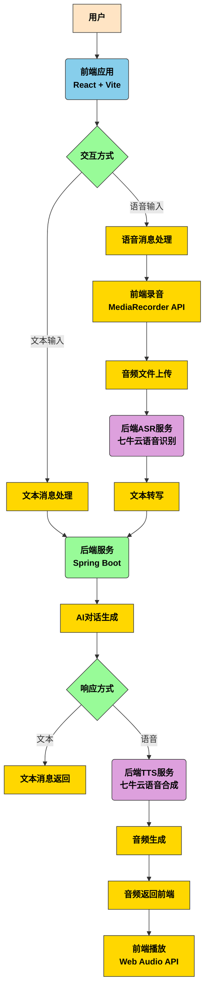
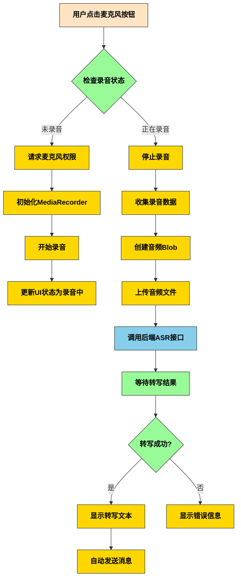
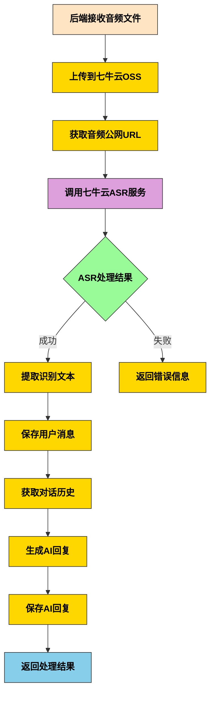
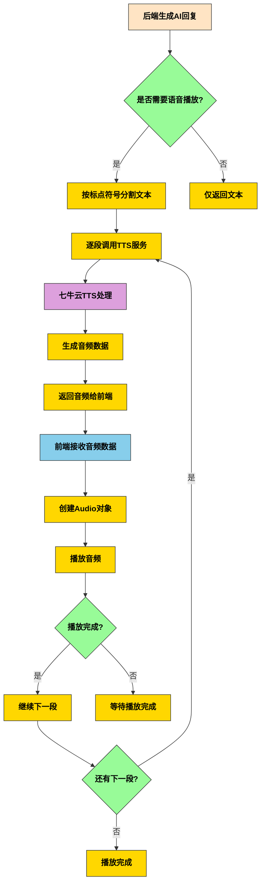
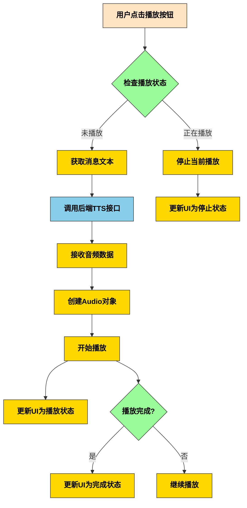

# 语音对话实现路线图

## 1. 整体架构概览

## 2. 语音输入实现流程

## 3. 语音识别(ASR)处理流程

## 4. 文本转语音(TTS)处理流程

## 5. 前端语音播放流程

## 6. 关键技术组件

### 6.1 前端组件
- **MediaRecorder API**: 用于录音功能
- **Web Audio API**: 用于音频播放
- **Web Speech API**: 作为TTS备选方案
- **React Hooks**: 状态管理

### 6.2 后端组件
- **VoiceChatController**: 语音对话控制器
- **QiniuAsrService**: 七牛云语音识别服务
- **QiniuTtsService**: 七牛云语音合成服务
- **QiniuOSSService**: 七牛云对象存储服务

### 6.3 第三方服务
- **七牛云ASR**: 语音识别
- **七牛云TTS**: 文本转语音
- **七牛云OSS**: 音频文件存储

## 7. 数据流说明

### 7.1 语音输入数据流
1. 用户点击麦克风按钮开始录音
2. 前端使用MediaRecorder API录制音频
3. 录音结束后生成音频Blob
4. 音频文件上传到后端
5. 后端将音频上传到七牛云OSS
6. 后端调用七牛云ASR服务进行语音识别
7. ASR服务返回识别结果
8. 后端将识别文本保存为用户消息
9. 后端生成AI回复并保存
10. 前端接收处理结果并显示

### 7.2 语音输出数据流
1. 后端生成AI回复文本
2. 按标点符号将文本分割成片段
3. 逐段调用七牛云TTS服务生成音频
4. 音频数据返回给前端
5. 前端创建Audio对象并播放
6. 播放完成后继续下一段，直至全部播放完成

## 8. 错误处理机制

### 8.1 录音错误
- 麦克风权限拒绝
- 浏览器不支持MediaRecorder
- 录音过程中断

### 8.2 ASR错误
- 音频文件上传失败
- 七牛云ASR服务调用失败
- 识别结果为空或无效

### 8.3 TTS错误
- 文本为空或无效
- 七牛云TTS服务调用失败
- 音频数据解析失败
- 音频播放失败

### 8.4 网络错误
- 后端服务不可达
- API调用超时
- 数据传输中断

## 9. 性能优化建议

### 9.1 前端优化
- 音频格式选择优化（优先MP3）
- 录音数据分段上传
- 音频缓存机制
- 并行处理多个语音片段

### 9.2 后端优化
- 连接池管理
- 异步处理音频上传
- TTS结果缓存
- 负载均衡

### 9.3 服务优化
- 七牛云CDN加速
- 音频文件压缩
- 批量处理请求
- 服务监控和日志分析